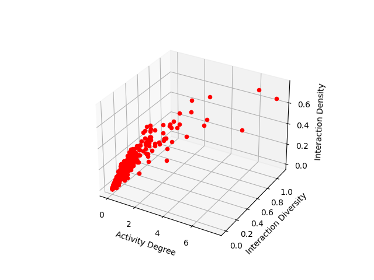
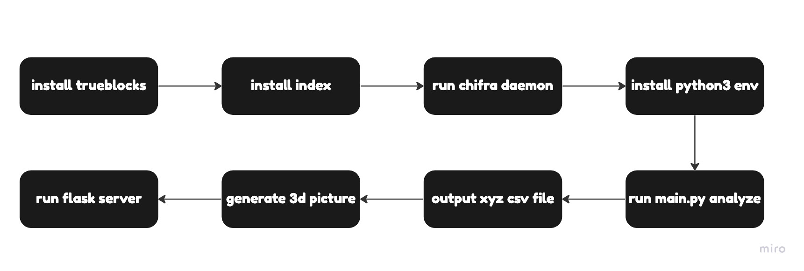

# Airdrop-Hunters-Killer

## Tree

```
├── LICENSE
├── README.md
├── analyze(analyze package)
├── api.py(python http server)
├── config.toml
├── data(source data)
├── generate.py(generate matplotlib 3d picture)
├── main.py(main analyze)
├── output
├── trueblocks(trueblocks api)
└── utils
```

## Overview

This is OpenData-Community hackathon project build for identify sybil attackers on blockchains. As we know it's easy for sybil attackers to isolation addresses.Advanced sybil attackers usually cut off the connection between their addresses.Hence it's hard for us to find out the sybil addresses via address relation.I think the biggest difference between real account and sybil account is that sybil attackers don't spend enough time on their each address.This will cause sybil account appear the below features:

- **Activity Degree**
- **Interaction Diversity**
- **Interaction Density**

So i wanna create an algorithm to estimate each score of above features. How to caculate each score ？

### Address Life Time

$$
lifeTime = calculateTime - firstTransactionTime
$$

### Activity Degree

$$
X = ActivityDegree = transactionCount/lifeTime
$$

### Interaction Diversity

$$
Y = InteractionDiversity = transactionFunction/lifeTime
$$

### Interaction Density

$$
Z = InteractionDensity = transactionDatesCount/lifeTime
$$

### Output

we analyze some address's transaction data using trueblocks api and display those data with python Matplotlib 3D. In this picture we found that some points are different with others. So we seperate those points into two parts.

- x <= 1 and y <= 1 or z <= 0.2, true
- x>1 or y>1 or z<0.2, false
  

## Links

- [youtube](https://youtu.be/gsd_qRfhjuI)

- [ocean protocol file](https://market.oceanprotocol.com/asset/did:op:d0714e46ae0bf3f7c3488109d0bdd406f7f026ef5e99e9d25c4ce7ae61d7b572)

## Install

#### install chifra

```
git clone https://github.com/TrueBlocks/trueblocks-core
cd trueblocks-core
mkdir build && cd build
cmake ../src
make
```

#### install core index

We use about 100g ssd to storage the index file.

```
chifra init --all
```

#### trueblocks api server

```
chifra daemon
```

#### main analyze file

```
python3 main.py
```

output address score in output/result.csv

#### python flask

run python http server

```
pip3 install flask
export FLASK_APP=api
flask run
```

## Tech Stack

- Python(Pandas,Numpy,Matplotlib,Flask,Web3)
- Trueblocks
- Ocean Protocol
- Pocket Network RPC

## Flowchart



## API Doc For Flask Server

#### url

`http://127.0.0.1:5000/analyze?address=0xB315fBA4A6514100BdceA5C438E89dd9dd9F216F`

#### method

get

#### request

| Params  | Description         |
| ------- | ------------------- |
| address | string,user address |

#### response

| Params | Description |
| ------ | ----------- |
| code   | int         |
| data   | boolean     |
| error  | string      |

#### return

```
{
  "code":1,
  "data":true,
  "error":""
}
```

## Reference

- [1] Trueblocks <https://trueblocks.io/>
- [2] Pocket Network <https://www.pokt.network/>
- [3] Ocean Protocol <https://oceanprotocol.com/>
- [4] Python Flask <https://flask.palletsprojects.com/en/2.2.x/>
- [5] Python Pandas <https://pandas.pydata.org/>
- [6] Python Numpy <https://numpy.org/>
- [7] Python Matplotlib <https://matplotlib.org/>

## License

SPDX short identifier: MIT
